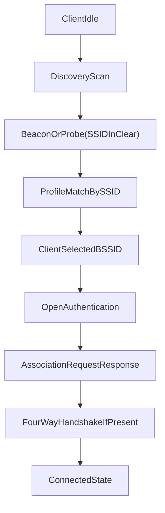

# Assignment 2 - Wireless Protocol Investigation Lab
## Track 3: SSID/BSSID Identity and Evil Twin Trust Assumptions

## 1. Title Page
- Course: Wireless and Mobile Network Security (2-7038910-1)
- Institution: Ariel University, Department of Computer Science
- Group members and IDs: `<fill>`
- Date: `<fill>`
- Hardware: MT7921U monitor adapter, AP1 `<model>`, AP2 `<model>`, client `<model>`
- Software: `<OS>`, Wireshark `<version>`, TShark `<version>`, Python `<version>`, PyShark `<version>`

## 2. Investigative Claim
"We will demonstrate that the SSID is visible in multiple unprotected frame types before any association takes place, that the BSSID is not cryptographically bound to the SSID in WPA2, and that a client will initiate association with a rogue AP presenting a known SSID without detecting the identity mismatch at the protocol level."

All conclusions in this report are framed as evidence-based observations from our own lab captures.

## 3. Evidence Plan
- Required frame families:
  - Beacon (`wlan.fc.type_subtype == 0x0008`)
  - Probe Request (`wlan.fc.type_subtype == 0x0004`)
  - Probe Response (`wlan.fc.type_subtype == 0x0005`)
  - Authentication (`wlan.fc.type_subtype == 0x000b`)
  - Association Request (`wlan.fc.type_subtype == 0x0000`)
  - Association Response (`wlan.fc.type_subtype == 0x0001`)
  - EAPOL (`eapol`)
- Baseline capture: `captures/track3_same_ssid_baseline_ap1_only.pcapng`
- Modified capture: `captures/track3_same_ssid_modified_ap1_ap2.pcapng`
- Filtered evidence captures:
  - `captures/track3_filtered_baseline_authorized_only.pcapng`
  - `captures/track3_filtered_modified_authorized_only.pcapng`

## 4. Background
- SSID is a network identifier visible in management traffic.
- BSSID identifies a specific AP radio interface.
- In WPA2-PSK, data protection depends on key establishment after management-stage selection.
- Track 3 question: what identity signal does the client use before association, and what is cryptographically protected later.
- Related research context: SSID confusion findings (WiSec 2024).

## 5. Threat Model
- Asset: correct network identity selection for saved SSID profile.
- Adversary in this lab: controlled rogue-condition AP broadcasting same SSID from a different BSSID.
- Capabilities:
  - same SSID advertisement from multiple BSSIDs
  - influence AP selection conditions
  - observe management behavior in monitor capture
- Limitations:
  - no credential cracking
  - no unauthorized networks/devices
  - no out-of-scope traffic analysis
- Question under test:
  - In our WPA2 setup, can pre-association behavior be explained by visible SSID/profile matching and client-selected BSSID evidence?

## 6. Lab Setup
- AP1 (baseline AP): `<BSSID_AP1>`, SSID `<TARGET_SSID>`, WPA2-PSK.
- AP2 (rogue-condition AP): `<BSSID_AP2>`, same SSID and WPA2-PSK.
- Client station: `<CLIENT_MAC>`, saved profile for target SSID.
- Monitor station: MT7921U in monitor mode, fixed channel per condition.
- Isolation controls:
  - only authorized lab devices
  - filtered analysis by authorized MAC list
  - unrelated traffic excluded from analysis

## 7. Experiment Design
- Baseline condition:
  - AP1 enabled, AP2 disabled/out-of-range
  - trigger client reconnect
  - collect full discovery -> auth -> assoc -> EAPOL sequence
- Modified condition:
  - AP1 and AP2 enabled, same SSID
  - same reconnect trigger
  - capture same sequence and identify selected BSSID
- Controlled variable:
  - AP identity availability (same SSID advertised by multiple BSSIDs and client-selected BSSID)
- Constants:
  - client, credentials, monitor adapter, capture workflow, authorized scope

## 8. Packet Evidence
Use and complete: `report/packet_evidence_template.md`

Key filters:
- `(wlan.fc.type == 0 || eapol) && (wlan.addr == <client_mac> || wlan.addr == <ap1_bssid> || wlan.addr == <ap2_bssid>)`
- `wlan.ssid == "<target_ssid>" && wlan.fc.type == 0`
- `wlan.bssid == <ap1_bssid> || wlan.bssid == <ap2_bssid>`

## 9. Parser / Analysis Output
- Script: `parser/ssid_track3_parser.py`
- Outputs:
  - `outputs/frames.csv`
  - `outputs/claim_summary.json`
- Extracted minimum fields:
  - frame number, timestamp, tx, rx, bssid, type/subtype
  - claim-relevant fields: ssid, RSN presence, AKM, pairwise cipher, PMF bits (if present), auth algorithm, association status, EAPOL message/replay data

## 10. Protocol Sequence / State-Machine Diagram

## 11. Security Analysis
- Evidence-backed observations to include:
  - where SSID appears in clear management traffic
  - where BSSID appears and how selected BSSID is identified
  - sequencing of auth/assoc before EAPOL evidence
- Keep conclusions bounded to observed captures and tested setup.

## 12. Limitations
- Results are device/driver/AP specific to tested lab hardware.
- No claim of universal behavior for all clients or all authentication methods.
- No UI-layer trust conclusions unless separately measured and documented.

## 13. Ethics and Scope
- All experiments performed only on authorized equipment and channels.
- No credential recovery attempts.
- No analysis of non-participating devices.
- Third-party frames filtered and excluded.

## 14. References
1. IEEE 802.11 standard family and RSN/802.11i material (IEEE Xplore).
2. Wireshark WLAN display filter reference: https://www.wireshark.org/docs/dfref/w/wlan.html
3. Wireshark RSNA EAPOL display filter reference: https://www.wireshark.org/docs/dfref/w/wlan_rsna_eapol.html
4. Gollier, H., Vanhoef, M. *SSID Confusion: Making Wi-Fi Clients Connect to the Wrong Network.* WiSec 2024. https://papers.mathyvanhoef.com/wisec2024.pdf
